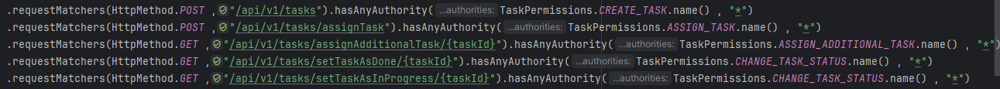
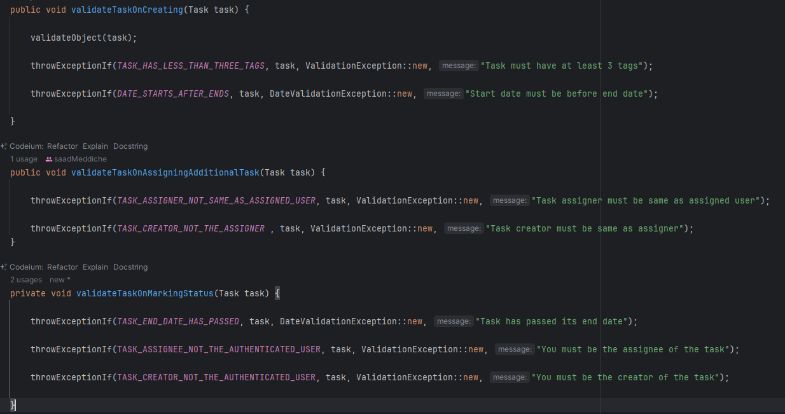

# Main Classes
- TaskService : [Link](src/main/java/com/taskflow/taskmanagement/services/implementations/TaskServiceImpl.java)
- TaskValidationService : [Link](src/main/java/com/taskflow/taskmanagement/services/validations/TaskValidationService.java)
- TaskController : [Link](src/main/java/com/taskflow/taskmanagement/controller/TaskController.java)

# Security Of Routes
- SecurityConfiguration : [Link](src/main/java/com/taskflow/taskmanagement/configuration/SecurityConfiguration.java)
- Image :

# Validations
- Create Task
- Assign Task
- Change Status Of Task
  