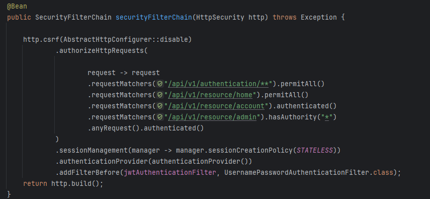
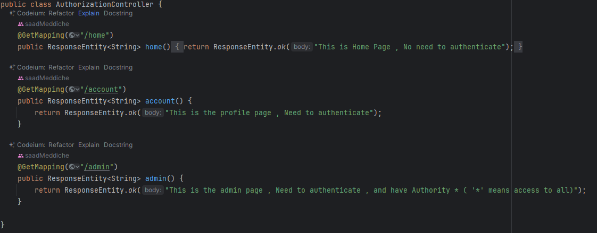
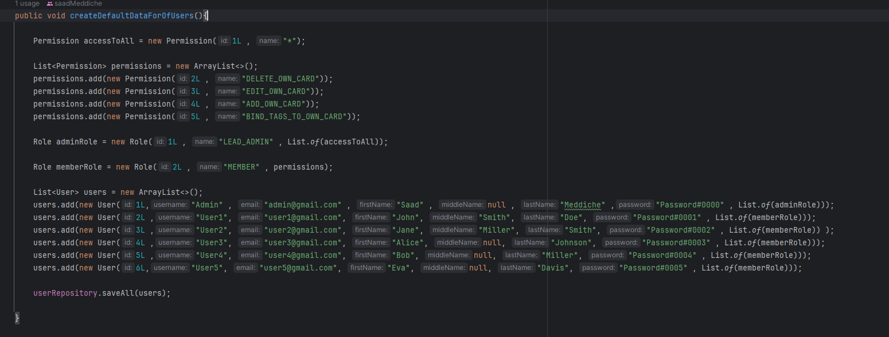

# ---Configuration Classes---

- JwtAuthenticationFilter [Link](src/main/java/com/taskflow/taskmanagement/configuration/JwtAuthenticationFilter.java)

- SecurityConfiguration [Link](src/main/java/com/taskflow/taskmanagement/configuration/SecurityConfiguration.java)

# Authorization

- Authorized Http Requests : [Link](src/main/java/com/taskflow/taskmanagement/configuration/SecurityConfiguration.java)

- AuthorizationController : [Link](src/main/java/com/taskflow/taskmanagement/controller/AuthorizationController.java)

# Authentication 

- AuthenticationService : [Link](src/main/java/com/taskflow/taskmanagement/services/implementations/AuthenticationServiceImpl.java)
- JwtService : [Link](src/main/java/com/taskflow/taskmanagement/services/implementations/JwtServiceImpl.java)

# Default Data

-   [Link](src/main/java/com/taskflow/taskmanagement/TaskmanagementApplication.java)

